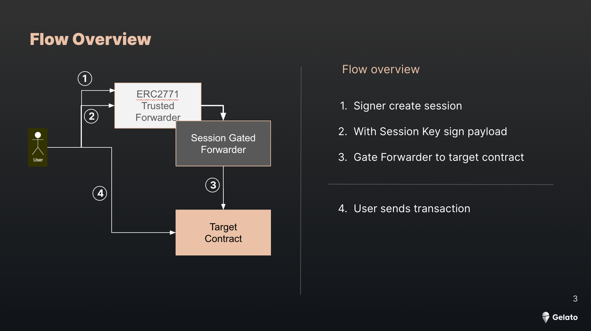

# Session Key Gated Forwarder

This project demonstrates the backend implementation of a contract called [Session Key Gate](contracts/SessionKeyGate.sol) to enable signless Ux.



The most important files to look at are:

- Session Key Gate contract [SessionKeyGate.sol](/contracts/SessionKeyGate.sol)
- Counter Contract [Counter.sol](/contracts/Counter.sol)
- TempKey class used to generate/store the Session Keys [TempKey](/scripts/tempKey.ts)


> **Note**  
> The Session Key Gate contract is deployed on Goerli at [0xde2568192B20A57dE387132b54C3fa492E33483](https://goerli.etherscan.io/address/0xde2568192B20A57dE387132b54C3fa492E334837#code) and the counter contract at [0x87CA985c8F3e9b70bCCc25bb67Ae3e2F6f31F51C](https://goerli.etherscan.io/address/0x87CA985c8F3e9b70bCCc25bb67Ae3e2F6f31F51C)

## Quick Start

Please copy .env.example to .env and add GELATO_RELAY_API_KEY, PK, ALCHEMY_ID and ETHERSCAN_API_KEY if you want to verify the contracts

1. Install dependencies
   ```
   yarn install
   ```
2. Compile smart contracts
   ```
   yarn  compile
   ```
3. Run unit tests
   ```
   yarn test
   ```
   In the Unit test [file](/test//Counter.test.ts) we are mocking the Gelato Relay sponsoredCallERC2771 calls appending the address to the payload